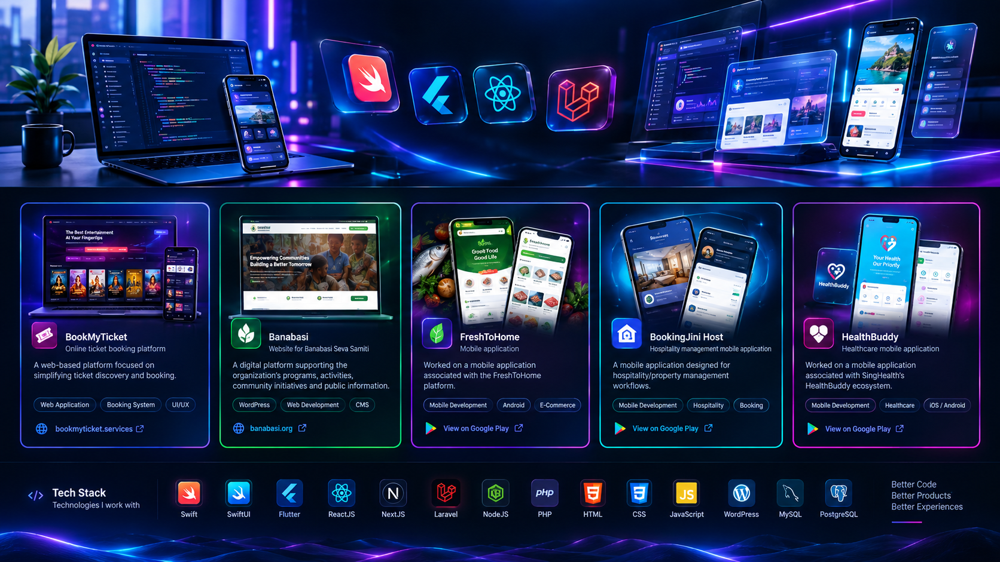

<div align="center">



</div>

<br>

<div align="center">

# 👋 Hi, I'm **Suraj Kumar Mandal**

### `Mobile & Full-Stack Developer`

Building **modern mobile apps, scalable web applications & backend systems**
with a focus on clean architecture, performance and great user experiences.

<br/>

<a href="https://surajkumarmandal.com/">
  
</a>
<a href="https://www.linkedin.com/in/suraj-kumar-mandal/">
  
</a>

<br/><br/>


</div>

---

## ⚡ About Me

```text
╭──────────────────────────────────────────────────────────────╮
│                                                              │
│  👨‍💻 Mobile & Full-Stack Developer                            │
│                                                              │
│  📱 iOS / Flutter Development                                │
│  🌐 Modern Web Applications                                  │
│  ⚙️ REST APIs & Backend Systems                              │
│  🧩 CMS & WordPress Solutions                                │
│  🗄️ Relational Database Design                               │
│                                                              │
│  Turning ideas into scalable digital products.               │
│                                                              │
╰──────────────────────────────────────────────────────────────╯
```

I enjoy building products that sit at the intersection of **technology, design and usability**.

My experience spans **native iOS development, cross-platform mobile applications, modern JavaScript frameworks, PHP/Laravel backends and WordPress solutions**.

> **Build simple. Design beautifully. Scale intelligently.**

---

## 🧬 Tech Stack

### 📱 Mobile Development

<p>

</p>

**Swift · SwiftUI · Flutter · Dart · iOS**

---

### 🌐 Frontend

<p>

</p>

**ReactJS · NextJS · HTML · CSS · JavaScript**

---

### ⚙️ Backend

<p>

</p>

**Laravel · NodeJS · PHP · REST APIs**

---

### 🗄️ Database

<p>

</p>

**MySQL · PostgreSQL**

---

### 🧩 CMS & Tools

<p>

</p>

**WordPress · Git · GitHub · VS Code**

---

# 🚀 Featured Work

A selection of products and applications I've worked on across **mobile, web and backend technologies**.

---

## 🎟️ BookMyTicket

**Online ticket booking platform**

A web-based platform focused on simplifying ticket discovery and booking.

**Focus**

`Web Application` `Booking System` `UI/UX`

🌐 **Live:** [bookmyticket.services](https://bookmyticket.services/)

---

## 🌱 Banabasi

**Website for Banabasi Seva Samiti**

A digital platform supporting the organization's programs, activities, community initiatives and public information.

**Focus**

`WordPress` `Web Development` `CMS` `Responsive Design`

🌐 **Live:** [banabasi.org](https://banabasi.org/)

---

## 🥩 FreshToHome

**Mobile application**

Worked on a mobile application associated with the FreshToHome platform.

**Focus**

`Mobile Development` `Android` `E-Commerce`

📱 **Google Play:**
[View on Google Play](https://play.google.com/store/apps/details?id=com.freshtohome)

---

## 🏨 BookingJini Host

**Hospitality management mobile application**

A mobile application designed for hospitality/property management workflows.

**Focus**

`Mobile Development` `Hospitality` `Booking`

📱 **Google Play:**
[View on Google Play](https://play.google.com/store/apps/details?id=com.bookingjini.bookingjiniHost)

---

## ❤️ HealthBuddy

**Healthcare mobile application**

Worked on a mobile application associated with SingHealth's HealthBuddy ecosystem.

**Focus**

`Mobile Development` `Healthcare` `iOS / Android`

📱 **Google Play:**
[View on Google Play](https://play.google.com/store/apps/details?id=com.singhealth.healthbuddy)

---

# 🧠 What I Build

```text
📱  Native iOS Applications
     └── Swift • SwiftUI

📲  Cross-Platform Applications
     └── Flutter • Dart

🌐  Modern Web Applications
     └── React • NextJS

⚙️  Backend & APIs
     └── Laravel • NodeJS • PHP

🧩  Content Management
     └── WordPress

🗄️  Data & Persistence
     └── MySQL • PostgreSQL
```

---

# 🛰️ Current Focus

```text
01  Building modern mobile experiences
02  Developing scalable REST APIs
03  Exploring modern application architecture
04  Creating clean and reusable UI systems
05  Improving performance & developer experience
```

---

## 📊 GitHub Activity

<div align="center">


</div>

<br/>

<div align="center">


</div>

---

# 🧩 Developer Philosophy

<div align="center">

### `Think → Build → Test → Improve → Ship`

<br/>

**Clean Code**
↓
**Better Architecture**
↓
**Better Products**
↓
**Better Experiences**

</div>

---

# 🌐 Let's Connect

<div align="center">

<a href="https://surajkumarmandal.com/">

</a>

<a href="https://www.linkedin.com/in/suraj-kumar-mandal/">

</a>

<br/><br/>

**Have an idea? Let's build something great. 🚀**

</div>

---

<div align="center">

### ⚡ `Code. Create. Iterate.`

<sub>© Suraj Kumar Mandal</sub>

</div>
